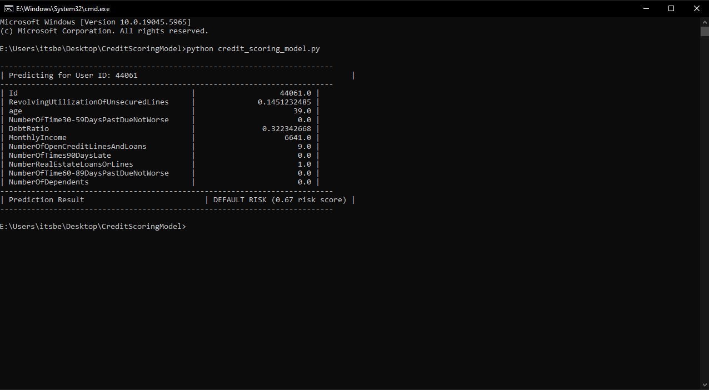

# 💳 Credit Scoring Prediction Model

This project predicts whether a person is likely to default on a loan using real-world financial data

---

## 🚀 Features

- Random Forest model using scikit-learn
- Predicts loan default (0 = safe, 1 = risky)
- Random user prediction from dataset
- MySQL-style terminal output formatting
- Evaluation metrics: Accuracy, Recall, ROC-AUC

---

## 📂 Project Structure

CreditScoringModel/ 
├── cs-training.csv 
├── credit_scoring_individual_predict.py 
├── requirements.txt 
└── README.md 

---

## ⚙️ Installation

Install the required Python libraries using: _pip install -r requirements.txt_

---

## 📂 Dataset Used `cs-training.csv` by [XiaoChan](https://www.kaggle.com/carolline89) from [Kaggle](https://www.kaggle.com/datasets/carolline89/cs-training/data).

---

## ⚙️ Technologies Used

- Python 🐍
- pandas, matplotlib, seaborn
- scikit-learn (Random Forest Classifier)

---

## 🖼️ Screenshot (Sample Output)

### 🧾 Sample Prediction Output (with Risk Score)

### ✅ Sample Prediction Output (Safe User)

---

## ▶️ How to Run

Run the main Python file using: _python credit_scoring_individual_predict.py_

The script will:
- Train a model using Random Forest
- Show evaluation (confusion matrix, accuracy, etc.)
- Randomly select one user from dataset
- Predict their loan default probability

---

## ✍️ Author

👤 Hirday Kapil
🎓 CodeAlpha Machine Learning Intern
📅 June 2025
